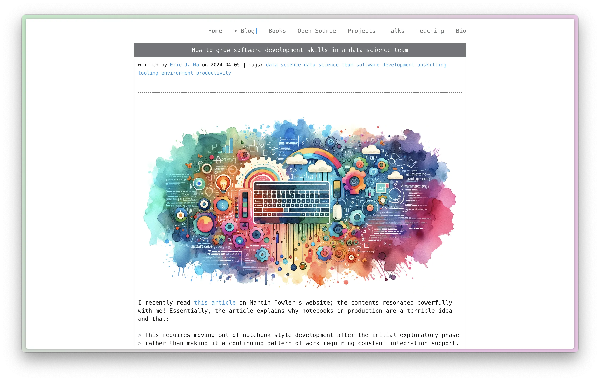

---
revealOptions:
  transition: slide
highlightTheme: nord
theme: black-contrast
css: css/custom.css
---

# 🌟 How LLMs Can Accelerate Data Science

[Eric J. Ma](https://ericmjl.github.io/)

`ericmjl.github.io/how-llms-can-accelerate-data-science/`

---

## 💁🏻‍♂️ About me

- 7 years of GPT-4 prompt engineering experience. <!-- .element: class="fragment" -->
- Proficient in telepathy, can communicate with future technologies. <!-- .element: class="fragment" -->
- Proficient in sending time-traveling emails. <!-- .element: class="fragment" -->

*I jest* <!-- .element: class="fragment" -->

---

## 💁🏻‍♂️ About me (take 2)

> "Sr. Principal Data Scientist, DSAI (Research) @  Moderna"

- Sr. Principal Data Scientist: Data science team lead <!-- .element: class="fragment" -->
- DSAI: Computer nerd <!-- .element: class="fragment" -->
- Research: Science nerd <!-- .element: class="fragment" -->

---

## Our team exists to...

> ...make discovery science run at the speed of thought and to quantify the previously unquantified.

---

## 2️⃣ 🧵

---

## 🧵 Thread 1️⃣: LLMs are incredibly empowering

----

### 🤖 Generative AI @ Moderna

- Fully embraced with democratized access to GPT4-128K. <!-- .element: class="fragment" -->
- Internal academy builds community. <!-- .element: class="fragment" -->
- Flowering of use citizen-generated use cases. <!-- .element: class="fragment" -->

----

### 🧠 LLMs are

- your most knowledgeable drafting agent <!-- .element: class="fragment" -->
- prone to mistakes <!-- .element: class="fragment" -->

*Trust but verify!* <!-- .element: class="fragment" -->

---

## 🧵 Thread 2️⃣: Data science necessarily involves writing software

----

### 📈 Data science requires coding

<iframe width="560" height="315" src="https://www.youtube.com/embed/cpbtcsGE0OA?si=EkKmZ_yWEpO0S9Hs" title="YouTube video player" frameborder="0" allow="accelerometer; autoplay; clipboard-write; encrypted-media; gyroscope; picture-in-picture; web-share" referrerpolicy="strict-origin-when-cross-origin" allowfullscreen></iframe>

----

### 🧑‍💻 Coding requires software skills

[](https://ericmjl.github.io/blog/2024/4/5/how-to-grow-software-development-skills-in-a-data-science-team/)

----

### 🖥️ Software skills can be grown

<a href="https://ericmjl.github.io/data-science-bootstrap-notes/get-bootstrapped-on-your-data-science-projects/"></a>

---

## 2️⃣ 🧵 (recap)

- LLMs are incredibly empowering
- Data science necessarily involves writing software

---

## ✨ LLMs Enable DS Teams to Draft Great Software

----

### 📝 Draft New Code

```python
from sklearn.ensemble import RandomForestRegressor
import pandas as pd

# Read the file `data.csv` and create a Random Forest regressor model
# to predict `output` from the rest of the columns.
```

The more specific, the better the LLM response.

----

### 📚 Draft Docstrings

```python
import pandera as pa
from .schemas import raw_data_schema

@pa.check_input(raw_data_schema)
def preprocess(df: pd.DataFrame):
    """Preprocess dataframe.

    :param df: pandas DataFrame
    """
    # Copilot is usually great at drafting out docstrings
```

----

### 🧪 Draft Tests

```python
@prompt
def draft_tests(function_body):
    """I have the following function

    {{ function_body }}

    Draft me three unit tests.
    """
```

---

## 💪 LLMs Gives Your Data Science Team Superpowers

----

### 📓 Refactor entire notebooks

```python
@prompt
def refactor(notebook_json):
    """Given the following Jupyter notebook code:

    {{ notebook_json }}

    Help me propose a suite of functions
    that can be refactored out from the notebook.
    """
```

----

### 🔍 Debug Stack Trace

```python
@prompt
def debug(stack_trace):
    """Given the following stack trace:

    {{ stack_trace }}

    Help me debug what's going on here
    by proposing hypotheses as to why
    I am encountering this error.
    """
```

----

### 📝 Draft Long-Form Documentation

```python
@prompt
def draft_documentation(
    presentation_transcript,
    diataxis_spec,
    documentation_type
):
    """I have the following meeting transcript:

    {{ presentation_transcript }}

    Here is the Diataxis spec for {{ documentation_type }}:

    {{ diataxis_spec }}

    Please draft for me the {{ documentation_type }} using
    the transcript as source material.
    """
```

Check out the Diataxis framework [here](https://diataxis.fr)!

----

## ✍️ Write commit messages

```text
commit 5ffff99bae4611bdcea09187d839e5b40b9ef630
Author: Eric Ma <ericmajinglong@gmail.com>
Date:   Mon Apr 15 15:55:18 2024 -0400

    feat(index): update professional title
    and add about sections

    - Update the professional title to
      "Senior Principal Data Scientist" at Moderna.
    - Add a humorous "About me" section
      with claims of GPT-4 prompt engineering experience,
      telepathy, and time-traveling emails.
    - Introduce a more serious "About me (take 2)" section
      detailing roles and expertise.
    - Highlight involvement in Generative AI at Moderna,
      emphasizing democratized access to GPT,
      community building through an internal academy,
      and the development of citizen-generated use cases.
```

----

## ✍️ If you want the tool...

```bash
pip install -U llamabot
llamabot git install-commit-message-hook
# Ensure you have an OpenAI API Key
```

----

### 🗃️ Draft Database Queries

```python
@prompt
def nl2sql(nl_request, schema):
    """Given the following database schema:

    {{ schema }}

    And the following natural language request:

    {{ nl_request }}

    Return for me the SQL necessary to satisfy the
    natural language request.
    """
```

----

### ❓ Ask Questions of Code Repos

```bash
llamabot repo chat https://github.com/webpro/reveal-md.git \
--checkout main \
--model-name gpt-4-0125-preview \
--panel
```

----

<!-- .slide: data-background-image="images/llamabot-repo-chat-panel.webp" data-background-size="contain"-->

----

### 📚 Learn a New Domain

```python
@prompt
def learn(concept, education_level):
    """You are an expert in {{ concept }}.

    I am looking to understand {{ concept }}.

    Explain it to me the way Richard Feynman would explain it
    to a student in {{ education_level }}.
    """
```

----

<!-- .slide: data-background-image="images/learn-new-topics.webp" data-background-size="contain" -->

----

### 😃 Add Emojis to Your Talk

```python
@prompt
def add_emojis(talk_md):
    """Given the following Markdown slide deck:

    {{ talk_md }}

    Add emojis to all of the title headers
    while preserving the original text.
    """
```

----

## 🧩 The Hardest Routine Parts of Data Science

1. Taking the time to document our work. <!-- .element: class="fragment" -->
2. Checking correctness of our work. <!-- .element: class="fragment" -->
3. Rapidly ramping up into a new knowledge domain. <!-- .element: class="fragment" -->

*LLMs can accelerate all of the above.* <!-- .element: class="fragment" -->

---

## 🚀 A Productive New World

- LLMs are an insanely great productivity tool. <!-- .element: class="fragment" -->
- Supercharge your learning and automate the boring stuff. <!-- .element: class="fragment" -->

---

## ⭐️ Thank You

---

## 🤔 Select reading

- [Grow DS team software development skills](https://ericmjl.github.io/blog/2024/4/5/how-to-grow-software-development-skills-in-a-data-science-team/)
- [Survey of LLM tooling](https://ericmjl.github.io/blog/2024/2/1/an-incomplete-and-opinionated-survey-of-llm-tooling/)
- [Organize and motivate a DS team](https://ericmjl.github.io/blog/2024/3/23/how-to-organize-and-motivate-a-biotech-data-science-team/)
- [Keep technically sharp as a DS team lead](https://ericmjl.github.io/blog/2024/2/25/how-to-keep-sharp-with-technical-skills-as-a-data-science-team-lead/)
- Data Science Bootstrap Notes [website](https://ericmjl.github.io/data-science-bootstrap-notes/get-bootstrapped-on-your-data-science-projects/) and [ebook](https://leanpub.com/dsbootstrap/)
